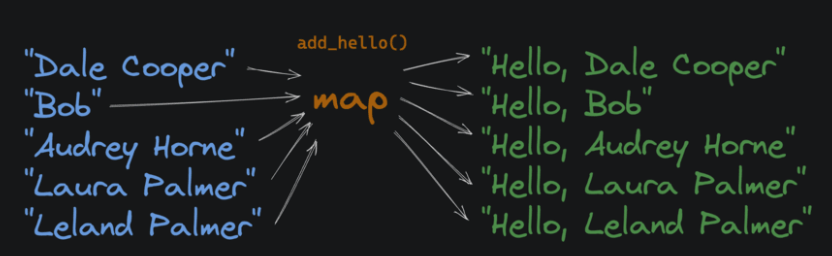
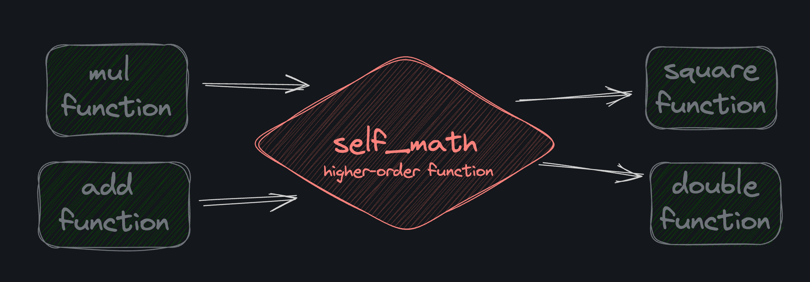

# what is functional programming 

Functional programming is a style (or "paradigm" if you're pretentious) of programming 
where we compose functions instead of mutating state (updating the value of variables).

Functional programming is more about declaring what you want to happen, rather than how you want it to happen.
Imperative (or procedural) programming declares both the what and the how.

## Immutability 

In FP, we strive to make data immutable. Once a value is created, it cannot be changed. Mutable data
on the other hand, can be changed after its created.

# Who cares 

Immutable data is easier to think about and work with. When 10 different function has access to the same variable, and you are
debbugging a problem with that variable you have to consider the possibility that any of those functions could have changed the value.

When a variable is immutable, you can be sure that it hasn't changed since it was created. It's a helluva lot easier to work with.

Generally speaking, immutability means fewer bugs and more maintainable code.

# Tuples vs Lists 

Tuples and lists are both ordered collections of values, but tuples are immutable and lists are mutable.

You can append to a list, but you can not append to a tuple. You can create a new copy of a tuple using values from an existing tuple, but you can't change the existing tuple.

Functional programming aims to be declarative. We prefer to declare what we want the computer to do, rather than muck around with the details of how to do it.

Let's take an extreme example and pretend we wanted to style a webpage with CSS (Obviously a hypothetical because, well, why would anyone want to work on the frontend???)

# Declarative styling 

The following CSS change all buttons elements to have red text 

`button{color:red}`

It does not execute line-by-line like an imperative language. Instead, it simply declares the desired style, and it's up to a web browser to figure out how to apply and display it.

# Imperative Styling 

Unlike functional programming (and CSS), a lot of code is imperative. We write out the exact step-by-step implementation details. This Python script draws a red button on a screen using the Tkinter library:

`from tkinter import * # first, import the library
master = Tk() # create a window
master.geometry("200x100") # set the window size
button = Button(master, text="Submit", fg="red").pack() # create a button
master.mainloop() # start the event loop`

## Its math 

Functional programming tends to be popular amongst developers with a strong mathematical background. After
all a math equation inst procedural. It's declerative. Take the followinf example 

avg = Σx/N

To put this calculation in plain English:

* Σ is just the Greek letter Sigma, and it represents "the sum of a collection".
* x is the collection of numbers we're averaging.
* N is the number of elements in the collection.
* avg is equal to the sum of all the numbers in collection "x" divided by the number of elements in collection "x".

so the equation really just say avg is the average of all the numbers in collection "x". This math equation iis a 
declarative way of writing calculate the average of a list of numbers". Here's some imperative Python code that does the same thing.

`def get_average(nums):
    total = 0
    for num in nums:
        total += num
    return total / len(nums)`

However, with functional programming, we would write code that's a bit more declarative:

`def get_average(nums):
    return sum(nums) / len(nums)`

## Classes vs Functions 

I run into new developers who, after learning about classes, want to use them everywhere. They assume that because they learned about functions first, functions are somehow inferior.

Nope. They're just different.

If you're unsure, default to functions. I find myself reaching for classes when I need something long-lived and stateful that would be easier to model if I could share behavior and data structure via inheritance. This is often the case for:

Video games
Simulations
GUIs

## Debugging FP 

It's nearly impossible, even for tenured senior developers, to write perfect code the first time. That's why debugging is such an important skill. The trouble is, sometimes you have these "elegant" (sarcasm intended) one-liners that are tricky to debug:

`def get_player_position(position, velocity, friction, gravity):
    return calc_gravity(calc_friction(calc_move(position, velocity), friction), gravity)`

If the output of get_player_position is incorrect, it's hard to know what's going on inside that black box. Break it up! Then you can inspect the moved, slowed, and final variables more easily:

`def get_player_position(position, velocity, friction, gravity):
    moved = calc_move(position, velocity)
    slowed = calc_friction(moved, friction)
    final = calc_gravity(slowed, gravity)
    print("Given:")
    print(f"position: {position}, velocity: {velocity}, friction: {friction}, gravity: {gravity}")
    print("Results:")
    print(f"moved: {moved}, slowed: {slowed}, final: {final}")
    return final`

Once you've run it, found the issue, and solved it, you can remove the print statements.

### Functions As Values
In Python, functions are just values, like strings, integers, or objects. For example, we can assign an existing function to a variable:

`def add(x, y):
    return x + y
addition = add
print(addition(2, 5))`

## Anonymous Functions 

Anonymous functions have no name, and in python they are called lambda functions after lambda calculus. 
Here's a lambda function that takes x as a argument and returns the result of x + 1

`lambda x:x+1`

Notice that the expression x + 1 is returned automatically, no need for a return statement. And because
functions are just values, we can assign the function to a variable named add_one

`add_one  = lambda x: x+1
print(add_one(2))`

lambda functions might look scary. but thetye arte still functions. Because they simply return the 
result of an expression, they are often used for small, simple evalutaions. Here's example that uses
a lambda to get a value from a dictionary.

`get_age = lambda name:{
            "lane": 29,
    "hunter": 69,
    "allan": 17

}.get(name,"not found")

print(get_age("lane"))`

### MAP 

"Map", "Filter", and "reduce" are three commonly used higher-order functional programming.

In python, the built-in map function takes a function and an iterable(in this case a list) as
inputs. It returns an iterator that applies the function to every item, yielding the result.

`def square(x):
    return x*x
    
nums = [1,2,3,4,5]
squared_nums = map(square,nums)
print(list(squared_nums))`

## Filter

The built-in filter function takes a function and an iterable (in this case a list) and returns a new iterable that only contains elements from the original iterable where the result of the function on that item returned True.

## reduce 

The built-in functools.reduce() function takes a function and a list of values, and applies the function to each value in the list, accumulating a single result as it goes.

### pure functions 

If you take nothing else away from this course, please take this: Pure functions are fantastic. They have two properties:

* They always return the same value given the same arguments.
* Running them cause no side effects

In short: pure functions don't do anything with anything that exists outside of their scope.

### Reference vs. Value
When you pass a value into a function as an argument, one of two things can happen:

It's passed by reference: The function has access to the original value and can change it
It's passed by value: The function only has access to a copy. Changes to the copy within the function don't affect the original
There is a bit more nuance, but this explanation mostly works.

These types are passed by reference:

* Lists
* Dictionaries
* Sets

These types are passed by value:

* Integers
* Floats
* Strings
* Booleans
* Tuples

# example  of pass by reference 

`def modify_list(inner_lst):
    inner_lst.append(4)
    
outer_lst = [1, 2, 3]
modify_list(outer_lst)`

`def attempt_to_modify(inner_num):
    inner_num += 1
outer_num = 1
attempt_to_modify(outer_num)`

### Recursion 

Recursion is a famously tricky concept to grasp, but it's honestly quite simple - don't let it intimidate you! A recursive function is just a function that calls itself!

If you thought loops were the only way to iterate over a list, you were wrong! Recursion is fundamental to functional programming because it's how we iterate over lists while avoiding stateful loops. Take a look at this function that sums the numbers in a list:

`def sum_nums(nums):
    if len(nums) == 0:
        return 0
    return nums[0] + sum_nums(nums[1:])

print(sum_nums([1, 2, 3, 4, 5]))`

### Function transformation 

"Function transformation" is just a more concise way to describe a specific type of higher order function. It's when a function takes a function (or functions) as input and returns a new function. Let's look at an example:

### currying 

Function currying is a specific kind of function transformation where we translate a single function that accepts multiple arguments into multiple functions that each accept a single argument.

This is a "normal" 3-argument function:

`box_volume(3, 4, 5)`

This is a "curried" series of functions that does the same thing:

`box_volume(3)(4)(5)`

Here's another example that includes the implementations:

`def sum(a, b):
  return a + b

print(sum(1, 2))`

And the same thing curried:

`def sum(a):
  def inner_sum(b):
    return a + b
  return inner_sum

print(sum(1)(2))`

### Decorators

Python decorators are just syntactic sugar for higher-order functions.

`def vowel_counter(func_to_decorate):
    vowel_count = 0 
    def wrapper(doc):
        nonlocal vowel_count
        `

